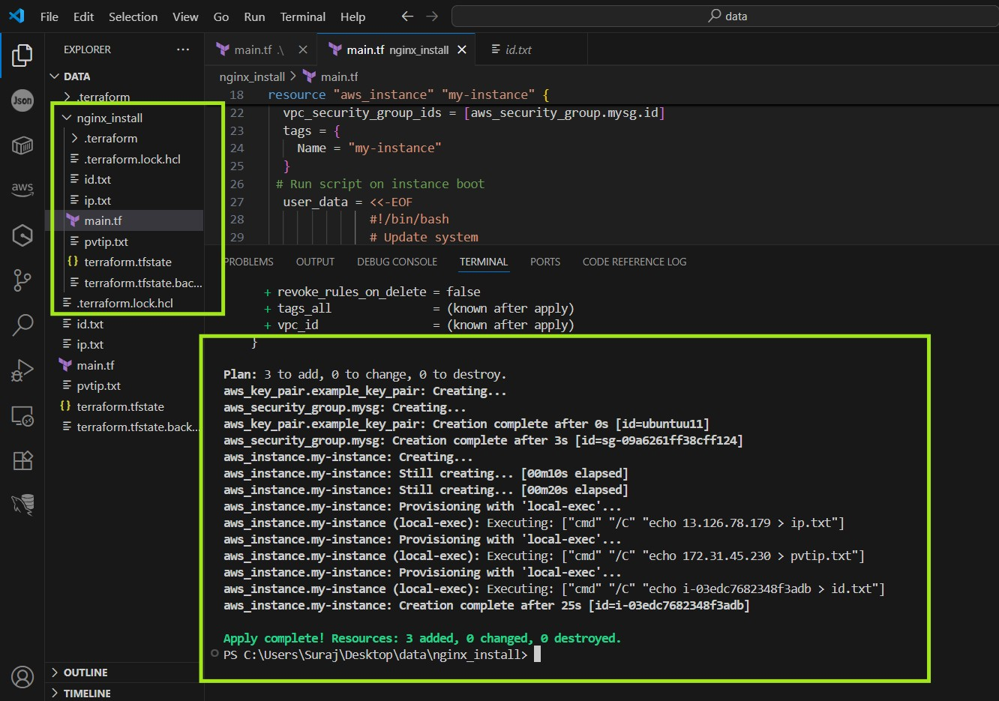

# Goal
Provision an Ubuntu EC2 instance in **ap-south-1 (Mumbai)** with a security group and **pre‑installed Nginx**, using Terraform from **VS Code**. It also generates an SSH key pair automatically and saves the private key locally.

---

## 1) Prerequisites
- **AWS account** with permissions for EC2, VPC, and Key Pairs.
- **AWS CLI** installed and configured.
- **Terraform CLI** installed (v1.5+ recommended).
- **VS Code** with the **HashiCorp Terraform** extension (optional but helpful).

> **Avoid hardcoding credentials** in Terraform. Use AWS CLI profiles or environment variables.

---

## 2) Configure AWS credentials (safe way)
Open a terminal and create a profile (example: `dev`).

```bash
aws configure --profile dev
# Enter AWS Access Key ID, Secret, region: ap-south-1, output: json
```

> You can also use environment variables instead of profiles (`AWS_ACCESS_KEY_ID`, `AWS_SECRET_ACCESS_KEY`, `AWS_DEFAULT_REGION`).

---

## 3) Create project folder
```bash
mkdir terraform-ec2-nginx
cd terraform-ec2-nginx
```
Open the folder in VS Code (File → Open Folder…).

---

## 4) Create a single-file Terraform config (`main.tf`)
Paste the following into **`main.tf`**:

```hcl
terraform {
  required_version = ">= 1.5.0"
  required_providers {
    aws = {
      source  = "hashicorp/aws"
      version = "~> 6.0"
    }
    tls = {
      source  = "hashicorp/tls"
      version = ">= 4.0"
    }
    local = {
      source  = "hashicorp/local"
      version = ">= 2.5"
    }
  }
}

# -------- Variables --------
variable "region" {
  description = "AWS region"
  type        = string
  default     = "ap-south-1"
}

variable "profile" {
  description = "AWS CLI profile name to use"
  type        = string
  default     = "dev"   # change if you used a different profile
}

variable "key_name" {
  description = "Name of the EC2 Key Pair"
  type        = string
  default     = "ubuntuu11"
}

# -------- Provider --------
provider "aws" {
  region  = var.region
  profile = var.profile
}

# -------- Get latest Ubuntu 22.04 LTS AMI (Canonical) --------
data "aws_ami" "ubuntu" {
  most_recent = true
  owners      = ["099720109477"] # Canonical

  filter {
    name   = "name"
    values = ["ubuntu/images/hvm-ssd/ubuntu-jammy-22.04-amd64-server-*"]
  }
  filter {
    name   = "virtualization-type"
    values = ["hvm"]
  }
}

# -------- Security Group (SSH 22, HTTP 80) --------
resource "aws_security_group" "web_sg" {
  name        = "tf-web-sg"
  description = "Allow SSH and HTTP"

  egress {
    from_port   = 0
    to_port     = 0
    protocol    = "-1"
    cidr_blocks = ["0.0.0.0/0"]
  }

  ingress {
    from_port   = 22
    to_port     = 22
    protocol    = "tcp"
    cidr_blocks = ["0.0.0.0/0"]
    description = "SSH"
  }

  ingress {
    from_port   = 80
    to_port     = 80
    protocol    = "tcp"
    cidr_blocks = ["0.0.0.0/0"]
    description = "HTTP"
  }

  tags = {
    Name = "tf-web-sg"
  }
}

# -------- Generate SSH key and create AWS Key Pair --------
resource "tls_private_key" "ssh_key" {
  algorithm = "RSA"
  rsa_bits  = 2048
}

resource "aws_key_pair" "kp" {
  key_name   = var.key_name
  public_key = tls_private_key.ssh_key.public_key_openssh
}

# Save private key to local file (secure permissions on Linux/macOS)
resource "local_file" "pem" {
  filename        = "${var.key_name}.pem"
  content         = tls_private_key.ssh_key.private_key_pem
  file_permission = "0400"
}

# -------- EC2 Instance with Nginx preinstalled --------
resource "aws_instance" "web" {
  ami                    = data.aws_ami.ubuntu.id
  instance_type          = "t2.micro"
  key_name               = aws_key_pair.kp.key_name
  vpc_security_group_ids = [aws_security_group.web_sg.id]

  tags = {
    Name = "tf-nginx-ubuntu"
  }

  user_data = <<-EOF
              #!/bin/bash
              set -eux
              export DEBIAN_FRONTEND=noninteractive
              apt-get update -y
              apt-get install -y nginx
              systemctl enable nginx

              # Clean default page(s)
              rm -f /var/www/html/index.nginx-debian.html /var/www/html/index.html || true

              # Create custom HTML
              cat > /var/www/html/index.html <<'HTML'
              <!DOCTYPE html>
              <html lang="en">
              <head>
                <meta charset="UTF-8" />
                <meta name="viewport" content="width=device-width, initial-scale=1.0" />
                <title>Welcome to My Terraform Nginx Server</title>
                <style>
                  body { background:#f4f4f4; font-family: Arial, sans-serif; text-align:center; padding-top:50px; }
                  h1 { color:#2c3e50; }
                  p { color:#555; }
                  .box { background:#fff; padding:20px; border-radius:10px; box-shadow:0 4px 6px rgba(0,0,0,.1); display:inline-block; }
                </style>
              </head>
              <body>
                <div class="box">
                  <h1>Hello from Terraform + Nginx 🚀</h1>
                  <p>This page was deployed automatically using <b>user_data</b>!</p>
                </div>
              </body>
              </html>
              HTML

              systemctl restart nginx
              EOF

  # Optionally save important values to files on your machine
  provisioner "local-exec" {
    command = "echo ${self.public_ip} > ip.txt"
  }
  provisioner "local-exec" {
    command = "echo ${self.private_ip} > pvtip.txt"
  }
  provisioner "local-exec" {
    command = "echo ${self.id} > id.txt"
  }
}

# -------- Outputs --------
output "public_ip" {
  value = aws_instance.web.public_ip
}

output "public_dns" {
  value = aws_instance.web.public_dns
}

output "ssh_command" {
  value = "ssh -i ./${var.key_name}.pem ubuntu@${aws_instance.web.public_ip}"
}
```

> If you **must** hardcode credentials (not recommended), you can add `access_key` and `secret_key` inside the `provider "aws" {}` block, but **remove them** before committing code.

---

## 5) Initialize & deploy
Run these commands from the project folder:

```bash
terraform init             # downloads providers

```


---
terraform fmt -recursive   # formats files
terraform validate         # checks syntax
terraform plan             # shows what will be created
terraform apply -auto-approve


```

Terraform will output the **public IP/DNS** and the ready‑to‑use **SSH command**.

---

## 6) Test the Nginx site
- Open a browser: `http://<PUBLIC_IP>`
- You should see the custom HTML page deployed by `user_data`.
```


```
---

## 7) SSH into the instance
- **Linux/macOS**:
  ```bash
  chmod 400 ubuntuu11.pem
  ssh -i ubuntuu11.pem ubuntu@<PUBLIC_IP>
  ```
- **Windows PowerShell** (OpenSSH):
  ```powershell
  ssh -i .\ubuntuu11.pem ubuntu@<PUBLIC_IP>
  ```
  > If Windows warns about permissions, right‑click the file → Properties → Security and restrict access to your user.

Default username for Ubuntu AMIs is **`ubuntu`**.

---

## 8) Clean up
```bash
terraform destroy -auto-approve
```
This tears down the EC2 instance, security group, and key pair. **Your local `.pem` file remains**—delete it manually if you no longer need it.

---

## 9) Common troubleshooting
- **`InvalidAMIID.NotFound`**: Region mismatch. Ensure `var.region = ap-south-1` and your AWS profile also uses `ap-south-1`.
- **`AuthFailure` / `NoCredentialProviders`**: Run `aws configure --profile dev` (or set env vars) and match the provider `profile`.
- **Cannot SSH**:
  - Use `ubuntu` as the user, not `ec2-user`.
  - Ensure port **22** is open in the security group.
  - Your **IP** must be allowed if you tightened the rule.
- **Site not loading**: Check security group for port **80**; on the instance run `sudo systemctl status nginx`.

---

## 10) Notes & variants
- To use your **existing** key pair instead of generating: remove the `tls_private_key` and `aws_key_pair` resources and set `key_name = "your-existing-key-name"` on the instance.
- To add HTTPS later: open port **443** and install certs with Let’s Encrypt (Nginx).

